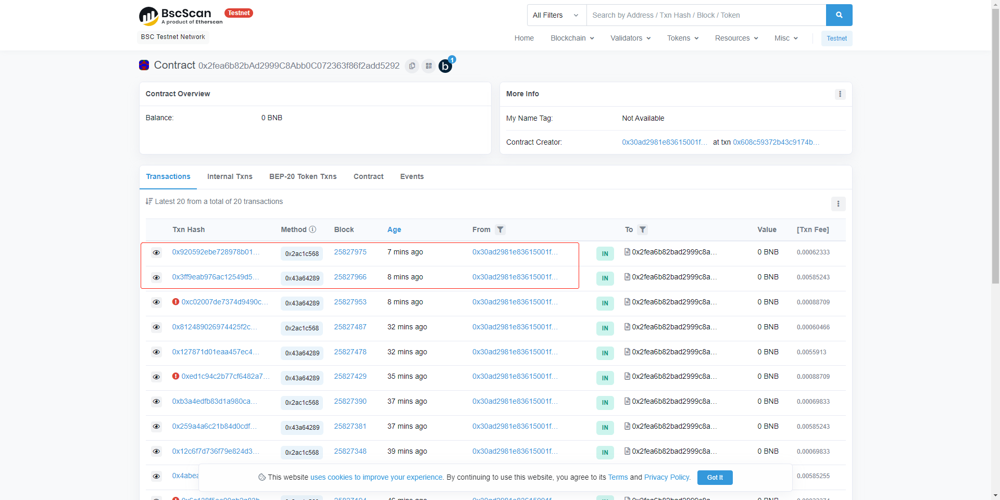

# contracts

## Prerequisites
- truffle >= v5.7.9
- node >= v18.12.1
- npm >= 8.19.2
- npx >= 8.19.2

## Installation
```
npm install
```

**If `truffle-config.js` does not exist**, add the configuration file `truffle-config.js` into the directory `./`. The file `truffle-config.js` can be generated by executing the command in an $empty directory$:
```
npx truffle init
```

**Note that:**  

- type `N` when asked `Overwrite contracts?`
- type `N` when asked `Overwrite migrations?`
- type `N` when asked `Overwrite test?`

After `truffle-config.js` is generated, then:  

- Uncommnet the content of `development`, like this:

```
development: {
     host: "127.0.0.1",     // Localhost (default: none)
     port: 8545,            // Standard Ethereum port (default: none)
     network_id: "*",       // Any network (default: none)
    },
```

## Compilation
```
touch .secret
npx truffle compile
```

## Unit test
### Launch local testnet
```
npx ganache -s 0
```

### Test
Open another terminate

```
npx truffle test
```

## Command line tool
### Install

* Get into this repo `./` first.
* Install node environment. 
```sh
npm install
```

### Usage

Command  
*-o, --omniBalance <token type>,<pk>  Query the balance of the omniverse token*

Query omniverse token amount of X
```
node register/index.js -o X,<OMNIVERSE_ACCOUNT>
```

Query omniverse token amount of Y
```
node register/index.js -o Y,<OMNIVERSE_ACCOUNT>
```

The result will be similar with follows:  
  
  
<p align="center">Figure.1 The balance of Token X and Token Y after swap</p>  

  
  
<p align="center">Figure.2 The balance of Token X of sender and receiver account after transfer</p>  

## Deployment

### Demo dApps

#### Non-fungible token

- PLATON: [0x68170f4Dc61c02771051CcD0FF26295D6330f47d](https://scan.platon.network/contract-detail?address=0x68170f4dc61c02771051ccd0ff26295d6330f47d)
- MOONBEAM(MOONBASEALPHA): [0xe07804c5e32423A95a0B1fA56845D7fC46230847](https://moonbase.moonscan.io/address/0xe07804c5e32423A95a0B1fA56845D7fC46230847)
- ETHEREUM(GOERLI): [0xcbC3b5A344eE3d55a7527F1a5e6dB4CE84DdB380](https://goerli.etherscan.io/address/0xcbC3b5A344eE3d55a7527F1a5e6dB4CE84DdB380)
- BSCTEST(BSC): [0xBF2F3eae1e507e6A6450C7E8BCa40b273962AA6B](https://testnet.bscscan.com/address/0xBF2F3eae1e507e6A6450C7E8BCa40b273962AA6B)
- SUBSTRATE: [Polkadot.js](https://polkadot.js.org/apps/?rpc=ws%3A%2F%2F35.158.224.2%3A9922#/chainstate)-uniques

#### Fungible token

- PLATON: [0x1181E9bBb48a5448c81CF1A2532A3D4257C69E22](https://scan.platon.network/contract-detail?address=0x1181e9bbb48a5448c81cf1a2532a3d4257c69e22)
- MOONBEAM(MOONBASEALPHA): [0x4B89eBA967d8333C6664F42A18EE5fb42e22a0dA](https://moonbase.moonscan.io/address/0x4B89eBA967d8333C6664F42A18EE5fb42e22a0dA)
- BSCTEST(BSC): [0x7c52b6e88c9Cc397d82506b9e4df6D7D06674934](https://testnet.bscscan.com/address/0x7c52b6e88c9Cc397d82506b9e4df6D7D06674934)
- SUBSTRATE: [Polkadot.js](https://polkadot.js.org/apps/?rpc=ws%3A%2F%2F35.158.224.2%3A9922#/chainstate)-assets

***NOTE: You should change the security settings when opening `Polkadot.js`, or you will get an error like this `Failed to construct 'WebSocket': An insecure WebSocket connection may not be initiated from a page loaded over HTTPS.`*

### Tutorial for deploying Omniverse tokens

Refer to this [tutorial](https://github.com/Omniverse-Web3-Labs/Omniverse-DLT-Introduction/blob/main/docs/Deployment.md)
